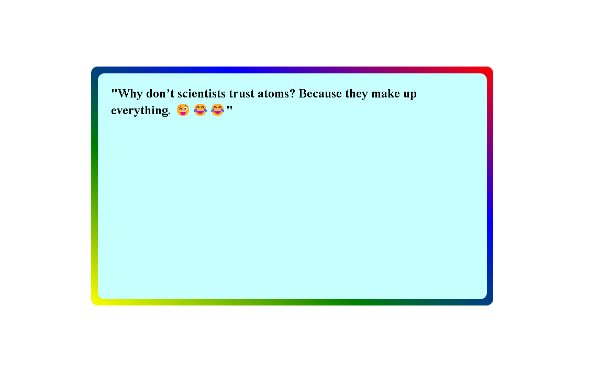
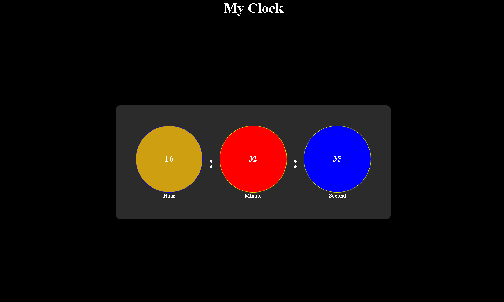
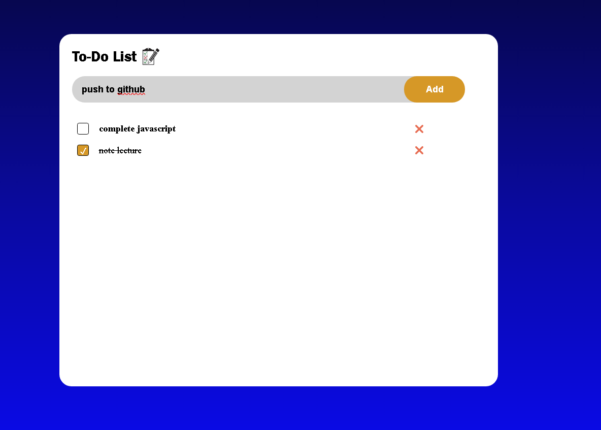
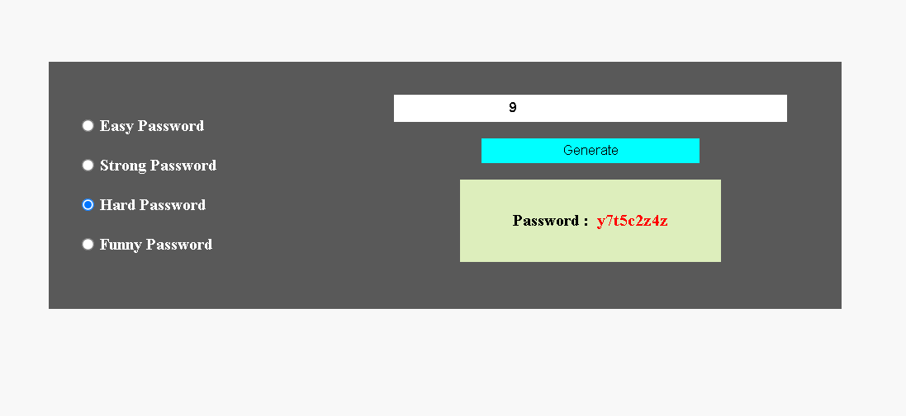
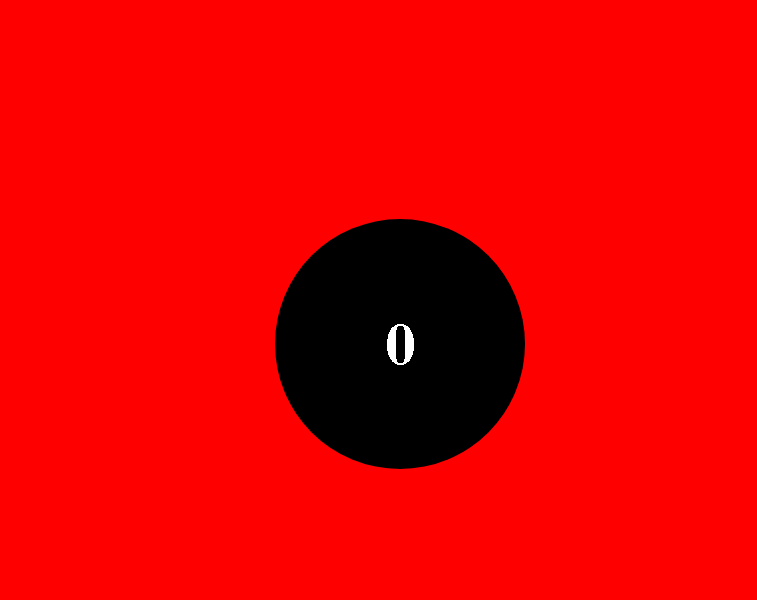

# JavaScript Study Material

Welcome to the javascript Study Material repository! This repository contains various resources, practice problems with solutions and some basic projects/exercises.  

## Contents

- **Study Material**: Comprehensive notes and explanations on various javaScript topics.

- **Practice Problems**: Problems on every topic with solution.

- **Projects**: Some basic projects/exercises like

  - Jokes (Ex-3) :

   

  - Clock (Ex-4) :

  

  - HackerMan (Ex-5) :

  

  - TodoList (Ex-6) :

  

  - PasswordGenerator (Ex-7) :

  

  - AlarmClock (Ex-8) :

  

## Learning Source

- **CodeWithHarry**:
I have learned javaScript from the amazing YouTube channel CodeWithHarry. [[Watch the video]](https://youtube.com/playlist?list=PLu0W_9lII9ahR1blWXxgSlL4y9iQBnLpR&si=agWw3nMHd3Zm4Xy-)

- **NamasteJavaScritp**:
I have also taken help the amazing youTube playlist NamasteJavaScript (Akshay Saini).
---